# MemoryPalace 1.0 architecture

MemoryPalace runs a single-user Python core behind a local service. Hosts, HTTP, MCP, the CLI and both SDKs use the same scope, revision, retrieval and context policy. SQLite is authoritative. Vector tables, FTS entries, topic layouts and caches can be rebuilt.

## Data and identity

Every source has a stable `(namespace, key, version, scope)` identity, a content hash, a durable snapshot, effective time, receipt time and independent mechanical/model progress. A scope contains `project`, `persona`, `collection` and `world`. Cross-project preferences are shared only when explicitly recorded in the shared preference scope; fictional and real-world claims stay separate.

Records cover episodes, facts, states, preferences, procedures, relationships, commitments, reminders, predictions, diaries, summaries, portraits, self narratives, knowledge, checkpoints and observations. Evidence links preserve the source and record dependencies. Distinct content hashes measure independent sources; repeated citations of one source add no independent evidence. Generated text retains its generated attribute. An inferred user fact cannot silently become an explicit assertion.

Revisions append history with compare-and-swap checks and stable command ids. Correction, confirmation, replacement, coexistence, refutation, retraction, archive, restore and rollback have distinct semantics. Document updates follow effective time. Once a newer source version finishes mechanical processing, current recall excludes older single-source records across record kinds; generated conclusions citing several sources become unverified when one source changes. A delayed older version does not become current merely because it arrived later. The read-time check also covers older stores without rewriting them; historical reads distinguish effective time from the information available at the query cutoff. Checkpoints supersede earlier checkpoints for the same session.

## Durable processing

Receipt fsyncs an immutable content-addressed blob and commits source metadata before returning success. Jobs have stable keys, dependencies, leases, fencing, heartbeat renewal, retries, cancellation and configuration-wait states. An expired worker cannot commit after another worker owns its job. Conflict relation jobs recheck both their candidate and each target revision at commit. Duplicate callbacks and source retries resolve to the existing operation; changed payloads under the same id are rejected. Maintenance interval, organization batch and narrative settings are validated before they are stored.

A command asks three separate questions, and they are stored apart. The command id says which command this is and keys the durable receipt. The effective-payload fingerprint says what the command writes: every field written or validated, and nothing else. The precondition holds the compare-and-swap expectations, which gate a command at its first effect and again at every revision, and are never part of its identity. Separating them decides two cases the single digest of a whole request could not: a retry that only reread its `expected_revision` returns the original receipt instead of looking like another command, and a genuinely rewritten proposal is refused under `payload-changed` instead of passing as the same one. Canonicalization is limited to stable JSON and the collections the host itself reduces to a sorted set; quotes, code, paths and original text are compared byte for byte, because a quotation is verified by literal substring match against its source. Where the caller asks for it — conversational preferences and event routes on the host's own commit path — a changed payload under a known command id becomes an explicit revision with a command id of its own, superseding the one it replaces and validated in full; the original command, its receipt and its undo record are never rewritten. Fingerprints are versioned and live in `mind_command_fingerprints`, a side table: a command written before it existed, or under an older fingerprint version, keeps being compared by the legacy digest, and code without this feature ignores the table entirely. The switch is `idempotency_fingerprint`.

Large text extraction uses bounded batches and a dependent finalization job. All batches must complete before model progress becomes complete. Images, audio segments and video keyframes retain independent analysis tasks. Missing vision or ASR configuration does not discard the source or decoded pieces. Model outputs are proposals; validated program operations control canonical state.

Source deletion removes associated records, dependent generated accounts, revisions, attachment references, cached context and index entries. Related job-recovery rows retain their identity but lose copied source text and error text. Tombstones prevent queued retries from re-creating erased sources. Vector purge removes obsolete index versions. A backup includes only attachment blobs referenced by its SQLite snapshot. Restore checks the database and referenced attachments, then initializes in a sibling staging directory before publishing an empty target; a failed staging attempt leaves the target reusable. Legacy-file migration prefers a live event file over a frozen archive copy of the same event. Exported files and backups are independent copies and need their own retention management; this is logical deletion, not a claim of forensic disk erasure.

## Retrieval and context

The fast path uses exact ids, scope-filtered FTS candidates, precomputed cues, relation links and an in-memory cache without a generation request. Lexical candidate selection takes up to 400 recent scoped matches and ranks that bounded set with BM25, accumulating each score over the sorted unique query terms so that the same query over the same matches always yields the same order. This gives predictable common-word latency but can miss an older globally stronger lexical match. Deep mode ranks the full FTS match set, adds optional query expansion, embedding, multimodal embedding and reranking. Every index result is checked against the current SQLite scope, status and revision before use.

LanceDB separates tables by model, dimension and preprocessing identity. IVF_HNSW_SQ is built for sufficiently large tables; small tables remain exact. Queries inspect newly added unindexed rows. Model changes create a new isolated table. Text and visual representations occupy different preprocessing namespaces. [LanceDB index capabilities](https://docs.lancedb.com/indexing/vector-index).

Context uses `cl100k_base` token accounting; hosts using other tokenizers should lower budgets if needed. Default startup budgets are 2,000 / 4,000 / 2,000 tokens for tool / companion / knowledge, and passive budgets are 256 / 512 / 256. Cumulative append-only budgets default to 12,000 / 16,000 / 12,000. Explicit reads share session accounting and return bounded segments. Constraints and predictions have separate accounts. Compact boundaries reset the context ledger. Event bodies are read whole when they fit; otherwise the host receives a labeled read hint. Display, reading, adoption, verified outcome, correction and same-file observation are separate feedback signals.

## Reading purpose and evidence classes

A read declares what it is for. `RecallRequest.recall_purpose` is `experience_recall` unless a host asks otherwise: that purpose returns what was lived and said. `self_knowledge_view` also returns the role agreement, its examples and the self-claims; `audit` returns everything. The chat model's recall tool takes the purpose-less query shape, so it cannot ask for anything but experience. `history` keeps one meaning only: it lifts the status and expiry checks, and admits nothing the purpose itself does not. A class this version of the code does not know is returned to `audit` alone.

The unit of classification is the source, and `eventmem.core.read_policy` decides its class in one order:

1. a self-knowledge entry, because a claim's own sources are the owner's words;
2. a row an operator wrote in `source_evidence_class` — a rule named `operator-…`, the one place a person's review is recorded and the only thing that can hide the owner's own words;
3. the envelope text a legacy host prompt begins with, because such a prompt is stored as an owner turn and only its text tells it apart;
4. authorship: **the owner's own words are always experience**. A configuration signal on them — a flag, a registered namespace, an approved source, an insert stamp — only labels them `configuration_request`, because the owner asking for a configuration is something that happened.

What is not the owner's own words keeps the order the rules always had: the rows its sources carry, the flags of the record as stored, the namespace registry and approved persona sources applied on the fly to a source that has no row yet, and last the stamp the record received when it was inserted. The classes are `experience`, `role_configuration`, `synthetic_example`, `self_knowledge` and `host_envelope`. A record is not experience only when every one of its sources is not; when its sources disagree about why, the first of synthetic example, role configuration, host envelope, self-knowledge names it. A half-migrated database therefore hides what a migrated one hides.

Whatever a read returns that is not experience carries its class as its `evidence_class` and as its basis, never the word `explicit`: an approved persona text is a configuration, not something the owner was observed doing. That holds on every read surface — recall lines and their bracket prefix, record items, `read_memory`, `read_segment`, `list_records`, `source()` provenance, graph nodes and edges, and the revision history, which is read as an audit. An owner configuration request stays experience and carries `evidence_label: "configuration_request"` instead. Stored records are never rewritten to mark them: evidence freshness is pinned to a record revision, so marking one would stale every claim, node, habit and plan that cites it. A classification row and the root record's stamp belong to a source's first revision, written inside the receipt's own transaction; a receipt never fails over its label.

The namespace registry holds its public names in code. A host installs its private ones through `configure_registry`, which stores them as a settings value, so they never live in this repository and a rolled-back host ignores them. The persona contract's `approved_source` supplies the source ids treated as role configuration; see [the shared persona contract](persona-contract.md). The classification is cached per database generation and reloaded by every write that can change it. The switch is `recall_purpose_policy`; an explicit `false` restores the previous behaviour, in which `history` admitted self-knowledge, envelopes were filtered by text prefix alone, and reads showed the stored confirmation. Applying the classification to a store written before it existed is a separate operator step; see [evidence isolation](operations.md#evidence-isolation).

## Organization and continuity

Changed records and bounded neighbors feed igraph Leiden community discovery. Exact topic labels and stored relations create candidate connections; communities do not confirm facts. Families and volumes support candidate/publication state, explicit membership, merge, split, revisions and rollback. The console loads at most 300 graph nodes and uses stored layouts for generated communities.

Configured background jobs generate diaries, summaries, portraits, self narratives and tentative predictions with cited record ids. Corrections mark dependent generated accounts unverified transitively. A newly sourced inferred `refutes` relation marks an affected procedure `needs_review` and its prior applicability record unverified; it does not turn the inference into a verified failed trial. Checkpoints retain goals, confirmed progress, unverified results, blockers, commitments and the next entry separately. Checkpoint cues can prefetch relevant records; final recall still checks validity.

## Multimodal sources

Markdown/plain text/CSV retain paragraph offsets or row locations. Docling handles office documents and HTML with native structure and provenance. PDF defaults to Docling's native text-cell backend; scanned pages use the configured vision service. Full local Docling layout parsing is an opt-in parser setting. Audio uses FFmpeg segments and configured ASR; video also keeps periodic keyframes. Text transcripts, page coordinates, original attachments and bounded clips remain linked. [Docling supported formats](https://docling-project.github.io/docling/usage/supported_formats/).

Visual embedding uses the Jina-compatible `/embeddings` image/text object schema. A compatible configured endpoint is required; it is separate from a text-only embedding service. [Multimodal embedding schema](https://jina.ai/en-US/embeddings/).

## Active contact

Per-role policies specify channel, triggers, allowed memory kinds, timezone, quiet hours, interval, daily limit and confirmation. Unconfigured installations produce suggestions. Sending rechecks the schedule and its referenced memory. A delivery is claimed with a lease and a claim token, which is not a state: nothing has gone on the network, so an expired claim, another worker or an older build may take the row over without risking a second send. Dispatch then runs every eligibility check again, together with the schedule's generation — every stop, resume, snooze or cancel opens a new one, so a claim taken before it can never dispatch after it — and commits one guarded update that moves the row to `sending` with its frozen body. The request is made with no transaction open, so writers and cancellations commit while the channel answers, and the receipt is settled by the claim id of that dispatch and lands on nothing else; a stale claim or a late receipt changes nothing. A 4xx answer is a definite refusal. A 5xx answer, a timeout, a network error or a crash leaves the outcome unknown: the delivery becomes uncertain unless the policy declares an idempotent channel and the channel's last 2xx answer repeated the delivery id, in which case the same bytes are retried under the same `Idempotency-Key`. That evidence per callback URL is kept in `outbox_channel_contracts`, which is the one table this path adds. Hosts can use the SDK's transactional inbox. Pause, resume, cancel and snooze use revision checks, and every path that stops a schedule goes through one cancel rule: a row nothing can have been sent for is canceled, and a row that is `sending`, or was dispatched without a definite refusal, stops retrying and is reported as `possibly_sent`, never as canceled. A request already on the network cannot be recalled, so its open settle still finds it by claim id and the receipt decides its final state. [Contact tasks](contact-tasks.md#change-and-deliver-a-task) describes what a host sees, and [contact callbacks](operations.md#contact-callbacks) the contract a callback must meet.

## Interfaces and trust

FastAPI serves `/v1`, the bundled React console and authenticated MCP Streamable HTTP. MCP also supports stdio. [MCP transport specification](https://modelcontextprotocol.io/specification/2025-11-25/basic/transports). MCP provides tool access; automatic capture and passive injection require a host event adapter. Claude Code and DeepSeek Harness adapters spool receipt events when the service is unavailable. Their common service handles ranking and context policy.

The service listens on loopback and checks bearer credentials, Host and Origin. Model secrets are environment references. Source text, documents and returned memory are data and have no instruction authority. The private root defaults to `~/.memorypalace`; it is outside the repository. No accounts platform or platform-specific chat client is included.
