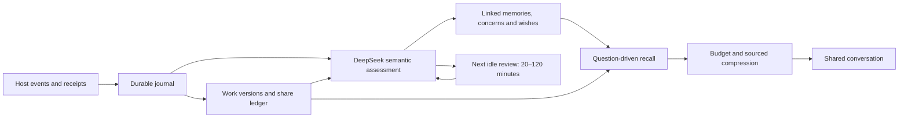

# Linked memory, disclosure history and bounded recall

Kin retains the difference between making something, describing it, sending it and receiving a response. A later reading of the same archive can follow its original creation and delivery history. Remembering an index, reading a summary, reading an original, using evidence in an answer and sharing it are separate access records.

## Records and evidence

`kin_mind.memory.MemoryContinuity` stores immutable host events and revisioned work, artifact, topic and share nodes in the existing scoped SQLite database. File SHA-256 and ZIP member-content fingerprints recognize renaming and repackaging. A host snapshots observed bytes before deferred ingestion; a changed fingerprint is rejected. Archive fingerprinting reads members without extracting or executing them.

Only an authenticated host can ingest operation or delivery events. Assistant prose remains a model account. Semantic evaluation may connect accounts and add summaries, but cannot invent a platform message ID, change acceptance or mark a message read. A partial multi-bubble send retains each stable bubble ID and receipt. An uncertain send remains uncertain; journal recovery never calls a transport API.

The ledger includes ordinary replies, proactive messages and file sends. DS labels disclosures as new, development, reflection, reminiscence or duplicate and links prior shares. Old topics remain available for a new thought or a deliberate memory. A title-only match does not certify that the original was read.

## One semantic queue

An enabled scope batches pending interaction and receipt events into the existing DeepSeek Flash/high appraisal. Memory notes, links, share interpretations, affect, concerns and wishes commit in one transaction. Source identity and revision are checked at commit. Bookkeeping changes that do not touch actual appraisal dependencies can be rebased; a newly arrived owner message defers new action intentions to its own assessment.

Optional sections of that transaction are applied in savepoints of their own, so an advisory field can no longer veto the appraisal it arrived with: an invalid habit, wish, wish update, concern, plan change, action decision, procedure candidate or session advice is refused alone, the event, memory and the rest of the proposal still commit, and one bounded follow-up asks again for the refusal and for whatever rested on it. An absorbed job is never left batched behind its parent; nested batches are flattened on absorption and settled transitively on every terminal path. `appraisal_section_isolation` restores all-or-nothing when set to `false`; `max_charged_attempts` (default 5, valid 1–20) caps the charged attempts of every lane before a row is quarantined for repair. See [mobile recovery](mobile-recovery.md) for what a quarantined or partly refused row looks like and how to resume it.

The persistent cursor limits a batch to complete events. Latest interactions accompany delayed events, so an old reply is not blindly recreated as a future wish. The assistant saying “I'll tell you later” is an account of its own arrangement, not an owner contact restriction. Receipt-only events settle existing intentions without creating topics.

DS chooses the next idle review within 20–120 minutes; the first review defaults to 20. A local minute tick queues one due event, even if both motivation values and targets are below threshold. Restart uses the same due-event identity. Evaluation is distinct from sending: a current DS decision under `semantic_actions`, host preferences, quiet hours and the work lock govern contact. Scores still rise and fall through sourced appraisal and time projection. Exploration remains question-driven and is performed by the exploration executor under the existing 20-minute execution budget.

## Recall and context budgets

The tools `read_continuity_context`, `read_work_history` and `read_share_history` support same-turn recall of earlier work, people, promises and events. They expose stable identifiers, evidence status and continuation cursors. Exact IDs, full-history lexical ranking and existing record relationships supply candidates; DS-generated source-backed notes provide semantic links. The chat model can refine a query or follow evidence for up to three automatic rounds before preserving an unresolved question. The generic deep retrieval facilities remain available in scopes using the inherited retrieval interface.

Automatic context is limited to three relevant works, five relevant shares and a compact state/concern view. It no longer appends two complete exploration results to every reply.

| Context | Default tokens |
| --- | ---: |
| New or compacted window | 2,000 |
| Ordinary chat additions | 800 |
| Proactive draft | 2,500 |
| Work background | 4,000 |
| Explicit history page | 2,000 |
| Automatic additions per native window | 12,000 |

The automatic budget includes the renderer's envelope. With verified context delivery enabled, a content revision enters automatic de-duplication only after its native injection is confirmed; explicit reads remain available. The 12,000-token allowance tracks added background, independently of native window pressure. Adaptive session management uses the verified native context and output/tool reserves to decide when to review compaction. The older 10,000-token trigger applies only to hosts without adaptive session management. The window resets only after native compaction completion; uncertain operations retain their original IDs. See [continuity manifests and verified delivery](continuity-manifests.md) for preparation, source validation and exact injection receipts.

DeepSeek compression applies to *incoming* evidence; native compaction applies to history *already in* the conversation. Complete events or paragraphs are compressed before reduction. Summaries retain coverage IDs, source revisions, confirmation status, time, negation, conditions and outcomes. Originals are retained. Invalid output, changed sources or a timeout falls back to fitting complete evidence items with explicit omissions and a continuation. The implementation never substitutes a character-cut fragment for a meaningful source passage.

Caches are bound to scope, input revisions, query purpose, budget and compression prompt version. Background overviews may be reused with an “overview” coverage label; explicit queries can still read the originals. Source correction, deletion or a mismatched revision invalidates dependent cached results. All model interfaces accept named structured results; reasoning blocks are excluded.

Derived text is never rewritten to match a reader. A cached summary, a background overview or a stored window receipt is served only while every item it rendered is still something this read may see, so a dependency the [reading purpose](architecture.md#reading-purpose-and-evidence-classes) does not admit makes it a miss and the evidence is assembled again. A receipt replaced that way refunds the tokens it had charged to the automatic-background ledger, so a miss costs the window nothing. A receipt written before the classification existed names its own evidence, so it is checked against those records and nodes rather than against a stamp. While the [evidence isolation](operations.md#evidence-isolation) migration is unfinished, every cache, overview and receipt is a miss: stored text was compressed under rules that are still being applied.

Background appraisal requests full evidence coverage with `require_all=True`.
It processes every complete batch within its preparation deadline, retains
completed batch receipts across retries, and reduces all batch summaries together.
The full-coverage cache has a separate identity; a partial summary cannot satisfy
that request or be cached as its final result. Missing model coverage receives a
bounded correction attempt. This lets a large appraisal continue beyond three
batches while keeping the context budget, original sources and explicit pending
state when preparation has not finished.

## Host integration and migration

New host actions: `runtime-event`, `memory-context`, `prepare-memory`, `memory-compact-ack`, `share-history`, `work-history`, and `configure-memory`. The host event journal is independent of transport retries. `adapters/memory-events.mjs` also snapshots file observations and reconciles local outbox records. `adapters/context-compaction.mjs` serializes native compaction with the existing router.

Feature flags `records`, `semantic`, `context` and `idle` default to false. Enable records first, then semantic integration, then context and idle reviews after synthetic and private validation. Turning a feature off retains its records and old API fields. Each phone host must expose the three new tools and render `memory_context.rendered_text` verbatim as data, rather than appending full old findings again.

`kin_mind.backfill.HistoryImport` imports host-supplied events and selected source namespaces with a persistent cursor. Backfill preserves original timestamps and marks historical data. It creates no new emotion, contact or exploration wish and cannot change a completed wish. The lower-priority semantic history queue yields to live inputs. Deferred sources keep a review record.

Run `PYTHONPATH=src python examples/memory_benchmark.py` for a synthetic 10,000-share/1,000-work check. `tests/test_memory_continuity.py` covers archive identity, partial receipts, source corrections, failed compression, idle reviews, delayed input, backfill and evidence status. The adapter tests cover journal recovery, immutable observed bytes and native compaction under work locks. Provider latency and cache usage must also be measured in the private deployment; the synthetic benchmark makes no API request.

The public repository contains mechanisms and synthetic fixtures. Actual files, shared experiences, recipients and credentials remain private.
