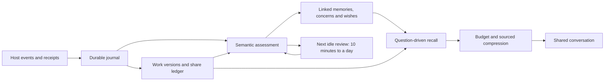

# Linked memory, disclosure history and bounded recall

Kin retains the difference between making something, describing it, sending it and receiving a response. A later reading of the same archive can follow its original creation and delivery history. Remembering an index, reading a summary, reading an original, using evidence in an answer and sharing it are separate access records.

```mermaid
flowchart LR
  H[Host events and receipts] --> J[Durable journal]
  J --> W[Work versions and share ledger]
  J --> D[Semantic assessment]
  W --> D
  D --> M[Linked memories, concerns and wishes]
  M --> R[Question-driven recall]
  W --> R
  R --> C[Budget and sourced compression]
  C --> T[Shared conversation]
  D --> I[Next idle review: 10 minutes to a day]
  I --> D
```

## Records and evidence

`kin_mind.memory.MemoryContinuity` stores immutable host events and revisioned work, artifact, topic and share nodes in the existing scoped SQLite database. File SHA-256 and ZIP member-content fingerprints recognize renaming and repackaging. A host copies an observed file of up to 8 MiB before deferred ingestion, and ingestion rejects a copy whose fingerprint has changed; a file of up to 512 MiB is recorded by its SHA-256 alone, and a larger one is not recorded. Archive fingerprinting reads members without extracting or executing them.

Only an authenticated host can ingest operation or delivery events. Assistant prose remains a model account. Semantic evaluation may connect accounts and add summaries, but cannot invent a platform message ID, change acceptance or mark a message read. A partial multi-bubble send retains each stable bubble ID and receipt. An uncertain send remains uncertain; journal recovery never calls a transport API.

The ledger includes ordinary replies, proactive messages and file sends. The appraisal labels disclosures as new, development, reflection, reminiscence or duplicate and links prior shares. Old topics remain available for a new thought or a deliberate memory. A title-only match does not certify that the original was read.

## One semantic queue

An enabled scope batches pending interaction and receipt events into the appraisal. It runs on DeepSeek Flash / high or, with `main_session_review`, on the main session's own model ([quiet assessment](mobile-sessions.md#quiet-assessment-in-the-current-session)); session maintenance follows the same choice. Memory notes, links, share interpretations, affect, concerns and wishes commit in one transaction. With the `operational_lanes` recovery feature, a separate enrichment job on DeepSeek writes the notes, links and disclosures in a transaction of its own. Source identity and revision are checked at commit. Bookkeeping changes that do not touch actual appraisal dependencies can be rebased; a newly arrived owner message defers new action intentions to its own assessment.

Optional sections of that transaction are applied in savepoints of their own, so an advisory field cannot veto the appraisal it arrived with: an invalid habit, wish, wish update, concern, plan change, action decision, procedure candidate or session advice is refused alone, and the event, memory and the rest of the proposal still commit. One bounded follow-up asks again when a habit, plan change, concern or action decision is refused or something that rested on a refusal was held back; other refusals are only recorded. An absorbed job is never left batched behind its parent; nested batches are flattened on absorption and settled transitively on every terminal path. `appraisal_section_isolation` restores all-or-nothing when set to `false`. A row on any lane is quarantined for repair after four charged attempts, or after the same failure twice in a row unless it is a timeout; `max_charged_attempts` (1–20) can lower that limit but not raise it. See [mobile recovery](mobile-recovery.md) for what a quarantined or partly refused row looks like and how to resume it.

The persistent cursor limits a batch to complete events. Latest interactions accompany delayed events, so an old reply is not blindly recreated as a future wish. The assistant saying “I'll tell you later” is an account of its own arrangement, not an owner contact restriction. A batch of receipts alone settles existing wishes; it adds no wish and changes no concern or rhythm.

The appraisal chooses the next idle review from ten minutes to a day ahead; the first review defaults to 20 minutes. A local minute tick queues one due event, even if both motivation values and targets are below threshold. Restart uses the same due-event identity. Evaluation is distinct from sending: a current decision under `semantic_actions` (with a DeepSeek high receipt or a verified main-session receipt), host preferences, quiet hours and the work lock govern contact. Scores still rise and fall through sourced appraisal and time projection. Exploration remains question-driven and is performed by the exploration executor under the existing 20-minute execution budget.

## Recall and context budgets

The tools `read_continuity_context`, `read_work_history` and `read_share_history` support same-turn recall of earlier work, people, promises and events. They expose stable identifiers, evidence status and continuation cursors. Exact IDs, full-history lexical ranking and existing record relationships supply candidates; source-backed notes from the appraisal provide semantic links. Deep recall refines its query for up to three rounds within 150 seconds and reports what stays unresolved. The generic deep retrieval facilities remain available in scopes using the inherited retrieval interface.

Automatic context takes at most three relevant works, five relevant shares and a state view with three concerns, beside host runtime, current intent, habits, graph findings and lexical matches; one page holds at most 16 items within its budget. It does not append complete exploration results to every reply.

| Context | Default tokens |
| --- | ---: |
| First chat addition in a new or compacted window | 2,000 |
| Ordinary chat additions | 800 |
| Proactive draft | 2,500 |
| Work background | 4,000 |
| Explicit history page | 2,000 |
| Automatic additions per native window | 12,000 |

The automatic budget includes the renderer's envelope. With verified context delivery enabled, a content revision enters automatic de-duplication only after its native injection is confirmed; explicit reads remain available. The table and the 12,000-token allowance, which tracks added background independently of native window pressure, apply without native-window accounting (`native_window_context` off). With it on, an automatic addition takes what its selection needs within a fixed 8,000-token ceiling and the room the native window reports, and no per-window total applies. Adaptive session management uses the verified native context and output/tool reserves to decide when to review compaction. A compaction request at 10,000 added tokens applies only to hosts without adaptive session management. The window resets only after native compaction completion; uncertain operations retain their original IDs. See [continuity manifests and verified delivery](continuity-manifests.md) for preparation, source validation and exact injection receipts.

Evidence compression applies to *incoming* evidence; native compaction applies to history *already in* the conversation. DeepSeek compresses, except inside a main-session appraisal, where the session's own model does. Input is split at paragraph boundaries into parts of up to 12,000 tokens; only a longer single paragraph is split inside. The host attaches coverage IDs, source revisions and confirmation status to each summary, and the compressor is asked to keep time, negation, conditions and outcomes. Originals are retained. Invalid output, changed sources or a timeout falls back to fitting complete evidence items with explicit omissions and a continuation. The implementation never substitutes a character-cut fragment for a meaningful source passage.

Caches are bound to scope, input revisions, query, budget and compression prompt version. Background overviews may be reused with an “overview” coverage label; explicit queries can still read the originals. Source correction, deletion or a mismatched revision invalidates dependent cached results. All model interfaces accept named structured results; reasoning blocks are excluded.

Derived text is never rewritten to match a reader. A cached summary, a background overview or a stored window receipt is served only while every item it rendered is still something this read may see, so a dependency the [reading purpose](architecture.md#reading-purpose-and-evidence-classes) does not admit makes it a miss and the evidence is assembled again. A receipt replaced that way refunds the tokens it had charged to the automatic-background ledger, so a miss costs the window nothing. A receipt without a classification stamp names its own evidence, so it is checked against those records and nodes. While the [evidence isolation](operations.md#evidence-isolation) migration is unfinished, every cache, overview and receipt is a miss: stored text cannot be trusted to follow rules that are still being applied.

Background appraisal requests full evidence coverage with `require_all=True`.
It processes every complete batch within its preparation deadline, retains
completed batch receipts across retries, and reduces all batch summaries together.
The full-coverage cache has a separate identity; a partial summary cannot satisfy
that request or be cached as its final result. Missing model coverage receives a
bounded correction attempt. This lets a large appraisal continue beyond three
batches while keeping the context budget, original sources and explicit pending
state when preparation has not finished.

## Host integration and migration

Host actions: `runtime-event`, `memory-context`, `prepare-memory`, `memory-compact-ack`, `share-history`, `work-history`, and `configure-memory`. The host event journal is independent of transport retries. `adapters/memory-events.mjs` also snapshots file observations and reconciles local outbox records. Native compaction belongs to the session manager ([mobile sessions](mobile-sessions.md)).

Feature flags `records`, `semantic`, `context` and `idle` default to false. Turning a feature off retains its records. Each phone host must expose the three reading tools and render `memory_context.rendered_text` verbatim as data.

Delivery receipts the journal missed are recovered from the outbox as historical `runtime-event` records. They keep their original timestamps, queue no appraisal of their own and drain after live events. `MemoryContinuity.queue_history` passes them on with its own cursor to lower-priority appraisals, which create no emotion or wish and change no existing one. A source that cannot be read is counted and passed over, and an abandoned source is marked with its reason.

Run `PYTHONPATH=src python examples/memory_benchmark.py` for a synthetic 10,000-share/1,000-work check. The compact [business suite](../tests/README.md) covers current memory and delivery workflows. Extended replay and fault injection are local acceptance work. Provider latency and cache usage must also be measured in the private deployment; the synthetic benchmark makes no API request.

The public repository contains mechanisms and synthetic fixtures. Actual files, shared experiences, recipients and credentials remain private.
