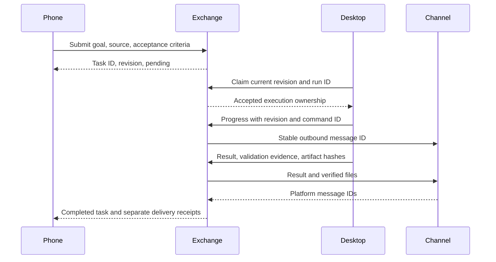

# Host task exchange

Phone and desktop hosts share task identifiers, executor ownership, ordered progress,
artifact hashes and transport receipts. `TaskHandoffs` uses a separate SQLite file;
control events never enter memory extraction or emotional evidence.

An authenticated host fixes the memory scope and actor before calling the API.
Task text is data and grants no new permissions. A source reference identifies the
original owner request; a copied document or model summary is not authorization.



`pending` means the executor has not accepted the task. Claiming does not execute
the goal. `accepted`, `running` and `waiting` retain ownership across restarts.
Completion requires validation evidence. Hosts verify artifact contents against
their recorded SHA-256 before committing or sending files.

All changes use revision checks and command deduplication. Reusing a command with
different content fails. Competing claims elect one executor; a restart does not
automatically reassign potentially running work. Canceling an unclaimed task stops
it. Canceling claimed work records a request and waits for the executor to acknowledge
stopping. It cannot continue or mark completion after that request.

Execution completion and delivery are separate states. Each progress/result event
gets stable child message IDs for text and files. The transport alone writes delivery
receipts. Missing IDs, timeouts and interrupted sending remain unconfirmed. A restart
checks the original receipts; it cannot replay a send under a new ID. Every result part
must be accepted before releasing the handoff's work lock. Server acceptance does not
prove a phone read.

The mobile router includes `runtime.handoffTasks` when deciding whether work is idle.
The host refreshes this count from the committed task ledger before a switch or task
completion check. Desktop result delivery does not count as delivery of an unrelated
mobile task.

## Host integration

The store exposes `submit`, `claim`, `update`, `cancel`, `get`, `list`, `events`,
`work_locks`, `outbox` and transport-only `delivery`. `events(after=...)` provides
an ordered cursor. `adapters/handoff-delivery.mjs` supplies file verification,
stable message IDs and receipt reconciliation with injected owner-bound transport.

```python
from eventmem.core.handoffs import TaskHandoffs

scope = {"project": "example", "persona": "companion", "collection": "default", "world": "test"}
phone = TaskHandoffs("private/task-exchange.sqlite3", scope, "mobile")
task = phone.submit(
    command_id="owner-request-1", recipient="desktop", session_id="shared-session",
    title="Example note", goal="Create an example note", source="verified-owner-input:1",
    acceptance="Read back the note and confirm the requested text",
)
desktop = TaskHandoffs("private/task-exchange.sqlite3", scope, "desktop")
claimed = desktop.claim(task["id"], revision=task["revision"], run_id="desktop-run-1", command_id="claim-1")
```

The exchange does not itself wake a desktop app. A consumer must run through its
supported task API, an active desktop task, or an existing maintenance wakeup.
Hosts expose this capability separately from a saved task receipt. They must not
open a competing native writer or imply that an idle desktop has started work.

Ordinary phone-originated computer work can keep using its existing local executor.
The exchange is for an explicit transfer or desktop-only capability, without copying
conversation history or creating another memory identity.

Tests cover concurrent claims, changed payloads, stale revisions, restart ownership,
cancellation, private scopes, artifact changes, partial sends, receipt uncertainty,
and the provider lock while a desktop result is outstanding.
