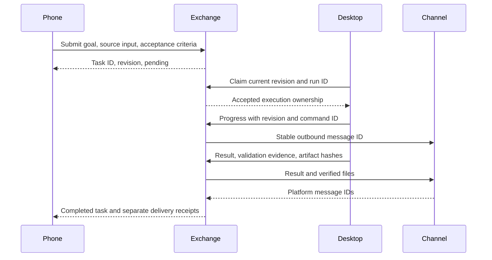

# Host task exchange

Phone and desktop hosts share task identifiers, executor ownership, ordered progress,
artifact hashes and transport receipts. `TaskHandoffs` uses a separate SQLite file;
control events never enter memory extraction or emotional evidence.

The calling host binds the memory scope and the actor (`mobile`, `desktop` or
`transport`) before using the store, which enforces what each actor may do but does
not authenticate the caller. Task text is data and grants no new permissions. A
source reference identifies the original owner request; a copied document or model
summary is not authorization. One owner input authorizes one handoff: a submission
whose `source_input_id` another command already used is refused with
`HandoffSourceUsed`, which names that command and its task, even after that task was
canceled. Repeating the same command returns its original receipt.


```mermaid
sequenceDiagram
    participant Phone
    participant Exchange
    participant Desktop
    participant Channel
    Phone->>Exchange: Submit goal, source input, acceptance criteria
    Exchange-->>Phone: Task ID, revision, pending
    Desktop->>Exchange: Claim current revision and run ID
    Exchange-->>Desktop: Accepted execution ownership
    Desktop->>Exchange: Progress with revision and command ID
    Exchange->>Channel: Stable outbound message ID
    Desktop->>Exchange: Result, validation evidence, artifact hashes
    Exchange->>Channel: Result and verified files
    Channel-->>Exchange: Platform message IDs
    Exchange-->>Phone: Completed task and separate delivery receipts
```

`pending` means the executor has not accepted the task. Claiming does not execute
the goal. `accepted`, `running` and `waiting` retain ownership across restarts.
Completion requires validation evidence. Hosts verify artifact contents against
their recorded SHA-256 before committing or sending files.

All changes use revision checks and command deduplication. Reusing a command with
different content fails. Competing claims elect one executor; a restart does not
automatically reassign potentially running work. Only the sender cancels. Canceling
an unclaimed task stops it. Canceling claimed work records a request and waits for
the executor to acknowledge stopping. It cannot continue or mark completion after
that request.

Execution completion and delivery are separate states. A progress or result event
saved with `notify` (the default) gets one outbox entry with a stable message ID for
its text and one for each file; a text past the channel's limit goes whole as one
file. The transport alone writes delivery receipts, and an entry is accepted only
when every part has a platform message ID. A part the platform refused fails the
entry; a part whose outcome is unknown is only looked up, never sent again or given
a new ID; parts proven never submitted go out again under their original IDs. An
attempt a restart cut off is settled as unconfirmed and then read back part by part.
Server acceptance does not prove a phone read.

`work_locks()` names the tasks a sender still waits on: one not yet finished, or a
finished one whose closing notice is still pending or being sent. A closing notice
that failed or whose send is unconfirmed is a delivery fact reconciled by its own
ID and holds nothing, and a task finished without a notice releases at once. The
mobile router counts the phone's locks as `runtime.handoffTasks` and treats work as
busy while one holds; the host refreshes the count from the committed exchange
whenever its database changes. The locks do not hold a release drain
(`GET /busy`). Desktop result delivery does not count as delivery of an unrelated
mobile task.

## Host integration

The store exposes `submit`, `claim`, `update`, `cancel`, `get`, `list`, `events`,
`work_locks`, `outbox` and transport-only `delivery`. `events(after=...)` provides
an ordered cursor. `adapters/handoff-delivery.mjs` supplies file verification,
stable message IDs and receipt reconciliation with injected owner-bound transport.

```python
from eventmem.core.handoffs import TaskHandoffs

scope = {"project": "example", "persona": "companion", "collection": "default", "world": "test"}
phone = TaskHandoffs("private/task-exchange.sqlite3", scope, "mobile")
task = phone.submit(
    command_id="owner-request-1", recipient="desktop", session_id="shared-session",
    title="Example note", goal="Create an example note", source="verified-owner-input:1",
    source_input_id="owner-input-1",
    acceptance="Read back the note and confirm the requested text",
)
desktop = TaskHandoffs("private/task-exchange.sqlite3", scope, "desktop")
claimed = desktop.claim(task["id"], revision=task["revision"], run_id="desktop-run-1", command_id="claim-1")
```

A phone host checks the cited input with its running router before submitting.
`POST /handoff-source` answers from the router's in-memory ledger, so an input
accepted a moment ago is found. The input qualifies when it is the owner's own
accepted message received within `handoffSourceMaxHours` (24 by default, 1–168
through `/configure`); otherwise the answer is `refused` with `source-not-found`,
`source-not-owner`, `source-not-accepted` or `source-too-old`, and an archived input
reads as too old. A host that gets no answer refuses the submission. A second
handoff citing the same input is answered with `source-already-authorized` and the
original `command_id` and `task_id`. Whether the input asks for this task is for Kin
to check before submitting.

The exchange does not itself wake a desktop app. A consumer must run through its
supported task API, an active desktop task, or an existing maintenance wakeup.
Hosts expose this capability separately from a saved task receipt. They must not
open a competing native writer or imply that an idle desktop has started work.

Ordinary phone-originated computer work can keep using its existing local executor.
The exchange is for an explicit transfer or desktop-only capability, without copying
conversation history or creating another memory identity.

`tests/business/test_handoffs.py` and `tests/business/handoff-delivery.test.mjs`
cover the work-lock rule, the one-source rule and part-by-part delivery: every part
accepted before completion, changed artifacts stopping transmission before the first
part, unknown parts never sent again, parts that never left sent again under their
own IDs, a refused part failing the handoff, and a long text sent whole as one file.
